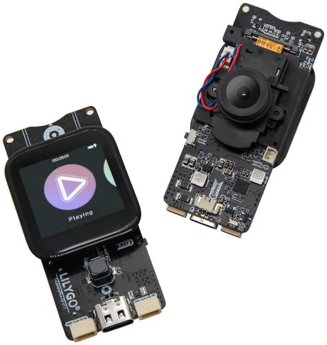
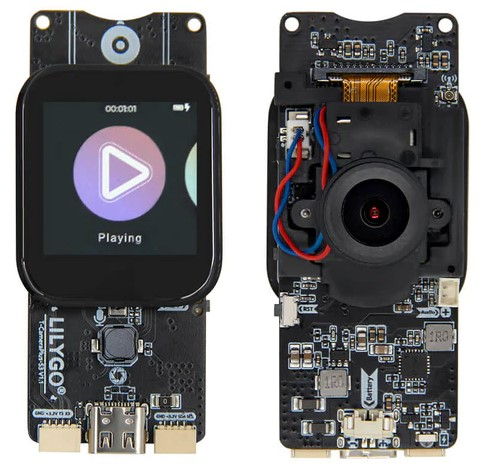

<!--
 * @Description: None
 * @Author: LILYGO_L
 * @Date: 2023-09-11 16:13:14
 * @LastEditTime: 2025-04-25 13:56:29
 * @License: GPL 3.0
-->

<h1 align = "center">T-CameraPlus-S3</h1>

    

 
  
  
  

 

## **[English](./README.md) | 中文**

## 版本迭代:
| Version                               | Update date                       |Update description|
| :-------------------------------: | :-------------------------------: |:--------------: |
| T-CameraPlus-S3_V1.0-V1.1            | 2023-10-23                         |  初始版本  |
| T-CameraPlus-S3_V1.2            | 2025-04-17                         |提升wifi性能，修改麦克风型号，修改引脚号优化走线    |

## 购买链接

| Product                     | SOC           |  FLASH  |  PSRAM   | Link                   |
| :------------------------: | :-----------: |:-------: | :---------: | :------------------: |
| T-CameraPlus-S3_V1.0-V1.1   | ESP32S3 |   16M   | 8M|  [LILYGO Mall](https://www.lilygo.cc/products/t-camera-plus-s3?_pos=2&_sid=aa4cbdb34&_ss=r)  |

## 目录
- [描述](#描述)
- [预览](#预览)
- [模块](#模块)
- [快速开始](#快速开始)
- [引脚总览](#引脚总览)
- [常见问题](#常见问题)
- [项目](#项目)

## 描述

T-CameraPlus-S3是基于ESP32S3芯片所开发的智能摄像头模组，板载240x240的TFT显示屏、数字麦克风、扬声器、一个独立按键、电源控制芯片、SD卡模块等。
出厂自带一个基于LVGL写的具有基本功能的UI，可实现文件管理、音乐播放、录音、摄像头投影等功能（如果出厂未写程序需要手动烧写示例名为“Lvgl_UI”的UI程序）

## 预览

### 实物图

    

---

    

## 模块

### 1. MCU

* 芯片：ESP32-S3
* PSRAM：8M 
* FLASH：16M
* 相关资料：
    >[Espressif](https://www.espressif.com/en/support/documents/technical-documents)

### 2. 屏幕

* 屏幕型号：fp-133h01d
* 尺寸：1.3英寸
* 分辨率：240x240px
* 屏幕类型：TFT
* 驱动芯片：ST7789V
* 总线通信协议：标准SPI
* 依赖库：
    >[Arduino_GFX-1.3.7](https://github.com/moononournation/Arduino_GFX)    
    >[lvgl-8.3.5](https://github.com/lvgl/lvgl)    
    >[JPEGDEC-1.2.8](https://github.com/bitbank2/JPEGDEC)    
    >[MiniTV](https://github.com/moononournation/MiniTV)    
    >[TFT_eSPI](https://github.com/Bodmer/TFT_eSPI)

### 3. 触摸

* 芯片：CST816S
* 总线通信协议：IIC
* 依赖库：
    >[cst816t-1.5.0](https://github.com/koendv/cst816t)    
    >[Arduino_DriveBus-1.1.16](https://github.com/Xk-w/Arduino_DriveBus)

### 4. 扬声器

* 芯片：MAX98357A
* 使用总线通信协议：IIS
* 其他说明：默认配置为Left/2 + Right/2通道，增益9dB，如需更改配置请根据T-CameraPlus-S3设计原理图上的说明更改电阻即可，选取的扬声器建议额定功率最大为3.2W，阻抗4欧左右8欧以下
* 相关资料：
    >[MAX98357A](./information/MAX98357AETE+T.pdf)
* 依赖库：
    >[arduino-libhelix-0.8.1](https://github.com/pschatzmann/arduino-libhelix)    
    >[ESP32-audioI2S-3.0.6](https://github.com/schreibfaul1/ESP32-audioI2S)

### 5. 麦克风

> #### T-CameraPlus-S3_V1.0-V1.1 版本
> * 芯片：MSM261S4030H0R
> * 总线通信协议：IIS
> * 其他说明：默认配置为右声道通道，如需更改配置请根据T-CameraPlus-S3设计原理图上的说明更改电阻即可
> * 相关资料：
>     >[MSM261S4030H0R](information/MSM261S4030H0R.pdf)
> * 依赖库：
>     >[DFRobot_MSM261](https://github.com/DFRobot/DFrobot_MSM261)    
>     >[Arduino_DriveBus-1.1.16](https://github.com/Xk-w/Arduino_DriveBus)

> #### T-CameraPlus-S3_V1.2 版本
> * 芯片：MP34DT05-A
> * 总线通信协议：PDM
> * 其他说明：默认配置为右声道通道，如需更改配置请根据T-CameraPlus-S3设计原理图上的说明更改电阻即可
> * 相关资料：
>    >[MP34DT05-A](./information/mp34dt05-a.pdf)
> * 依赖库：
>    >[Arduino_DriveBus-1.1.16](https://github.com/Xk-w/Arduino_DriveBus)

### 6. 摄像头
* 摄像头型号：OV2640
* 红外滤镜驱动：AP1511B
* 相关资料：
    >[OV2640_Hardware_Application_V1.04](information/OV2640_Hardware_Application_V1.04.pdf)    
    >[OV2640_Software_Application_V1.03](information/OV2640_Software_Application_V1.03.pdf)

### 7. 电源管理芯片
* 芯片：SY6970
* 相关资料：
    >[AN_SY6970 ](information/AN_SY6970.pdf)    
    >[EVB_SY6970](information/EVB_SY6970.pdf)
* 依赖库：
    >[XPowersLib-0.2.1](https://github.com/lewisxhe/XPowersLib)    
    >[Arduino_DriveBus-1.1.16](https://github.com/Xk-w/Arduino_DriveBus)

## 快速开始

### 示例支持

| Example | `[Platformio IDE][espressif32-v6.5.0]` `[Arduino IDE][esp32_v2.0.14]`| Description | Picture |
| ------  | ------  | ------ | ------ | 
| [Wifi_Scan](./examples/Wifi_Scan) | 
![alt text][supported] |  |  |
| [Lvgl_UI](./examples/Lvgl_UI) | 
![alt text][supported] | 出厂测试固件 |  |
| [Wifi_Music](./examples/Wifi_Music) | 
![alt text][supported] |  |  |
| [SD_Music](./examples/SD_Music) | 
![alt text][supported] |  |  |
| [DMIC_ReadData](./examples/DMIC_ReadData) | 
![alt text][supported] |  |  |
| [SD_DMIC](./examples/SD_DMIC) | 
![alt text][supported] |  |  |
| [TFT](./examples/TFT) | 
![alt text][supported] |  |  |
| [IIC_Scan_2](./examples/IIC_Scan_2) | 
![alt text][supported] |  |  |
| [Camera_WebServer](./examples/Camera_WebServer) | 
![alt text][supported] |  |  |
| [CST816D](./examples/CST816D) | 
![alt text][supported] |  |  |
| [GFX_Test](./examples/GFX_Test) | 
![alt text][supported] |  |  |
| [SY6970](./examples/SY6970) | 
![alt text][supported] |  |  |
| [SD_MJPEG](./examples/SD_MJPEG) | 
![alt text][supported] |  |  |
| [Camera_Screen](./examples/Camera_Screen) | 
![alt text][supported] |  |  |
| [Camera_Screen_OV5640_Auto_Focus](./examples/Camera_Screen_OV5640_Auto_Focus) | 
![alt text][supported] |  |  |
| [Camera_WebServer_OV5640_Auto_Focus](./examples/Camera_WebServer_OV5640_Auto_Focus) | 
![alt text][supported] |  |  |

[supported]: https://img.shields.io/badge/-supported-green "example"

| Firmware | Description | Picture |
| ------  | ------  | ------ |
| [Lvgl_UI(V1.0-V1.1)](./firmware/[T-CameraPlus-S3_V1.0-V1.1][Lvgl_UI]_firmware_202406142310.bin) |  |  |
| [Lvgl_UI(V1.2)](./firmware/[T-CameraPlus-S3_V1.2][Lvgl_UI]_firmware_202504081446.bin) |  |  |

### PlatformIO
1. 安装[VisualStudioCode](https://code.visualstudio.com/Download)，根据你的系统类型选择安装。

2. 打开VisualStudioCode软件侧边栏的“扩展”（或者使用<kbd>Ctrl</kbd>+<kbd>Shift</kbd>+<kbd>X</kbd>打开扩展），搜索“PlatformIO IDE”扩展并下载。

3. 在安装扩展的期间，你可以前往GitHub下载程序，你可以通过点击带绿色字样的“<> Code”下载主分支程序，也通过侧边栏下载“Releases”版本程序。

4. 扩展安装完成后，打开侧边栏的资源管理器（或者使用<kbd>Ctrl</kbd>+<kbd>Shift</kbd>+<kbd>E</kbd>打开），点击“打开文件夹”，找到刚刚你下载的项目代码（整个文件夹），点击“添加”，此时项目文件就添加到你的工作区了。

5. 打开项目文件中的“platformio.ini”（添加文件夹成功后PlatformIO会自动打开对应文件夹的“platformio.ini”）,在“[platformio]”目录下取消注释选择你需要烧录的示例程序（以“default_envs = xxx”为标头），然后点击左下角的“<kbd>[√](image/4.png)</kbd>”进行编译，如果编译无误，将单片机连接电脑，点击左下角“<kbd>[→](image/5.png)</kbd>”即可进行烧录。

### Arduino
1. 安装[Arduino](https://www.arduino.cc/en/software)，根据你的系统类型选择安装。

2. 打开项目文件夹的“example”目录，选择示例项目文件夹，打开以“.ino”结尾的文件即可打开Arduino IDE项目工作区。

3. 打开右上角“工具”菜单栏->选择“开发板”->“开发板管理器”，找到或者搜索“esp32”，下载作者名为“Espressif Systems”的开发板文件。接着返回“开发板”菜单栏，选择“ESP32 Arduino”开发板下的开发板类型，选择的开发板类型由“platformio.ini”文件中以[env]目录下的“board = xxx”标头为准，如果没有对应的开发板，则需要自己手动添加项目文件夹下“board”目录下的开发板。

4. 打开菜单栏“[文件](image/6.png)”->“[首选项](image/6.png)”，找到“[项目文件夹位置](image/7.png)”这一栏，将项目目录下的“libraries”文件夹里的所有库文件连带文件夹复制粘贴到这个目录下的“libraries”里边。

5. 在 "工具 "菜单中选择正确的设置，如下表所示。

| Setting                               | Value                                 |
| :-------------------------------: | :-------------------------------: |
| Board                                | ESP32S3 Dev Module|
| Upload Speed                     | 921600                               |
| USB Mode                           | Hardware CDC and JTAG     |
| USB CDC On Boot                | Enabled                             |
| USB Firmware MSC On Boot | Disabled                             |
| USB DFU On Boot                | Disabled                             |
| CPU Frequency                   | 240MHz (WiFi)                    |
| Flash Mode                         | QIO 80MHz                         |
| Flash Size                           | 16MB (128Mb)                     |
| Core Debug Level                | None                                 |
| Partition Scheme                | 16M Flash (3MB APP/9.9MB FATFS) |
| PSRAM                                | QSPI PSRAM                         |
| Arduino Runs On                  | Core 1                               |
| Events Run On                     | Core 1                               |

6. 选择正确的端口。

7. 点击右上角“<kbd>[√](image/8.png)</kbd>”进行编译，如果编译无误，将单片机连接电脑，点击右上角“<kbd>[→](image/9.png)</kbd>”即可进行烧录。

### firmware烧录
1. 打开项目文件“tools”找到ESP32烧录工具，打开。

2. 选择正确的烧录芯片以及烧录方式点击“OK”，如图所示根据步骤1->2->3->4->5即可烧录程序，如果烧录不成功，请按住“BOOT-0”键再下载烧录。

3. 烧录文件在项目文件根目录“[firmware](./firmware/)”文件下，里面有对firmware文件版本的说明，选择合适的版本下载即可。

    
    

## 引脚总览

> #### T-CameraPlus-S3_V1.0-V1.1 版本
>> | LCD引脚       | ESP32S3引脚      |
>> | :------------------: | :------------------:|
>> | MOSI                     | IO35                  |
>> | SCLK                  | IO36                  |
>> | RST                    | IO33                  |
>> | BL                      | IO46                  |
>> | CS                    | IO34                  |
>> | DC                    | IO45                  |
>
>> | IIS麦克风MSM261S4030H0R引脚 | ESP32S3引脚      |
>> | :------------------: | :------------------:|
>> | BCLK                  | IO18                  |
>> | WS                  | IO39                    |
>> | DATA                  | IO40                  |
>
>> | 功放MAX98357A引脚          | ESP32S3引脚      |
>> | :------------------: | :------------------:|
>> | BCLK                  | IO41                  |
>> | LRCLK                  | IO42                    |
>> | DATA                  | IO38                  |
>
>> | SD卡引脚          | ESP32S3引脚      |
>> | :------------------: | :------------------:|
>> | CS                  | IO21                  |
>> | SCLK                  | IO36                    |
>> | MOSI                  | IO35                  |
>> | MISO                  | IO37                  |
>
>> | 电源芯片SY6970引脚          | ESP32S3引脚      |
>> | :------------------: | :------------------:|
>> | SDA                  | IO1                  |
>> | SCL                  | IO2                    |
>> | INT                  | IO47                  |
>
>> | 摄像头OV2640引脚          | ESP32S3引脚      |
>> | :------------------: | :------------------:|
>> | RESET                  | IO3                  |
>> | XCLK                  | IO7                    |
>> | SIDO                  | IO1                  |
>> | SIOC                  | IO2                    |
>> | D7                  | IO6                  |
>> | D6                  | IO8                    |
>> | D5                  | IO9                  |
>> | D4                  | IO11                    |
>> | D3                  | IO13                  |
>> | D2                  | IO15                    |
>> | D1                  | IO14                  |
>> | D0                  | IO12                  |
>> | VSYNC             | IO4                  |
>> | HREF                  | IO5                  |
>> | PCLK                  | IO10                  |
>
>> | 触摸芯片引脚          | ESP32S3引脚      |
>> | :------------------: | :------------------:|
>> | SDA                  | IO1                  |
>> | SCL                  | IO2                    |
>> | RST                  | IO48                  |
>> | INT                  | IO47                  |

> #### T-CameraPlus-S3_V1.2 版本
>> | LCD引脚       | ESP32S3引脚      |
>> | :------------------: | :------------------:|
>> | MOSI                     | IO34                  |
>> | SCLK                  | IO35                  |
>> | BL                      | IO46                  |
>> | CS                    | IO36                  |
>> | DC                    | IO45                  |
>
>> | PDM麦克风MP34DT05TR引脚 | ESP32S3引脚      |
>> | :------------------: | :------------------:|
>> | LRCLK                  | IO40                  |
>> | DATA                  | IO38                  |
>
>> | 功放MAX98357A引脚          | ESP32S3引脚      |
>> | :------------------: | :------------------:|
>> | BCLK                  | IO41                  |
>> | LRCLK                  | IO42                    |
>> | DATA                  | IO39                  |
>
>> | SD卡引脚          | ESP32S3引脚      |
>> | :------------------: | :------------------:|
>> | CS                  | IO21                  |
>> | SCLK                  | IO35                    |
>> | MOSI                  | IO34                  |
>> | MISO                  | IO48                  |
>
>> | 电源芯片SY6970引脚          | ESP32S3引脚      |
>> | :------------------: | :------------------:|
>> | SDA                  | IO33                  |
>> | SCL                  | IO37                    |
>
>> | 摄像头OV2640引脚          | ESP32S3引脚      |
>> | :------------------: | :------------------:|
>> | XCLK                  | IO7                    |
>> | SIDO                  | IO1                  |
>> | SIOC                  | IO2                    |
>> | D7                  | IO6                  |
>> | D6                  | IO8                    |
>> | D5                  | IO9                  |
>> | D4                  | IO11                    |
>> | D3                  | IO13                  |
>> | D2                  | IO15                    |
>> | D1                  | IO14                  |
>> | D0                  | IO12                  |
>> | VSYNC             | IO3                  |
>> | HREF                  | IO5                  |
>> | PCLK                  | IO10                  |
>> | PWDN                  | IO4                  |
>
>> | 触摸芯片引脚          | ESP32S3引脚      |
>> | :------------------: | :------------------:|
>> | SDA                  | IO33                  |
>> | SCL                  | IO37                    |
>> | INT                  | IO47                  |

| 控制摄像头OV2640红外滤镜开关引脚     | ESP32S3引脚      |
| :------------------: | :------------------:|
| AP1511B_FBC                  | IO16                  |

| 按键KEY1引脚     | ESP32S3引脚      |
| :------------------: | :------------------:|
| KEY1                  | IO17                  |

## 常见问题

* Q. 看了以上教程我还是不会搭建编程环境怎么办？
* A. 如果看了以上教程还不懂如何搭建环境的可以参考[LilyGo-Document](https://github.com/Xinyuan-LilyGO/LilyGo-Document)文档说明来搭建。

 

* Q. 为什么打开Arduino IDE时他会提醒我是否要升级库文件？我应该升级还是不升级？
* A. 选择不升级库文件，不同版本的库文件可能不会相互兼容所以不建议升级库文件。

 

* Q. 为什么我的板子上“Uart”接口没有输出串口数据，是不是坏了用不了啊？
* A. 因为项目文件默认配置将USB接口作为Uart0串口输出作为调试，“Uart”接口连接的是Uart0，不经配置自然是不会输出任何数据的。 PlatformIO用户请打开项目文件“platformio.ini”，将“build_flags = xxx”下的选项“-DARDUINO_USB_CDC_ON_BOOT=true”修改成“-DARDUINO_USB_CDC_ON_BOOT=false”即可正常使用外部“Uart”接口。 Arduino用户打开菜单“工具”栏，选择USB CDC On Boot: “Disabled”即可正常使用外部“Uart”接口。

 

* Q. 为什么我的板子一直烧录失败呢？
* A. 请按住“BOOT”按键重新下载程序。

## 项目
* [T-CameraPlus-S3_V1.0-V1.1](project/T-CameraPlus-S3_V1.0-V1.1_20241109.pdf)
* [T-CameraPlus-S3_V1.2](project/T-CameraPlus-S3_V1.2_20240417.pdf)
